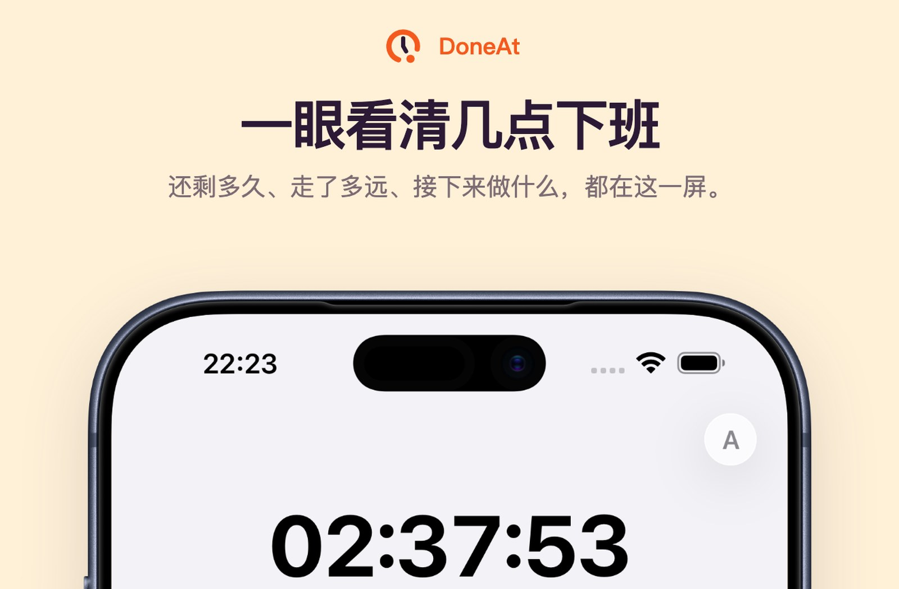
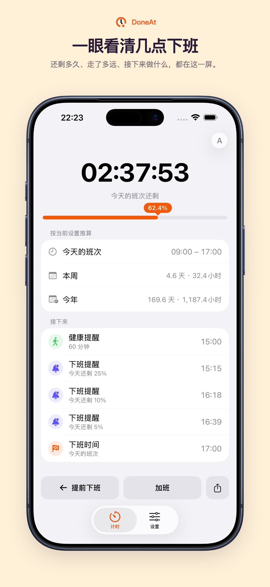
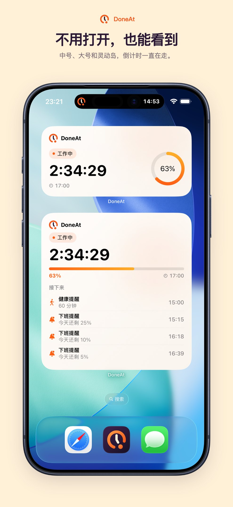
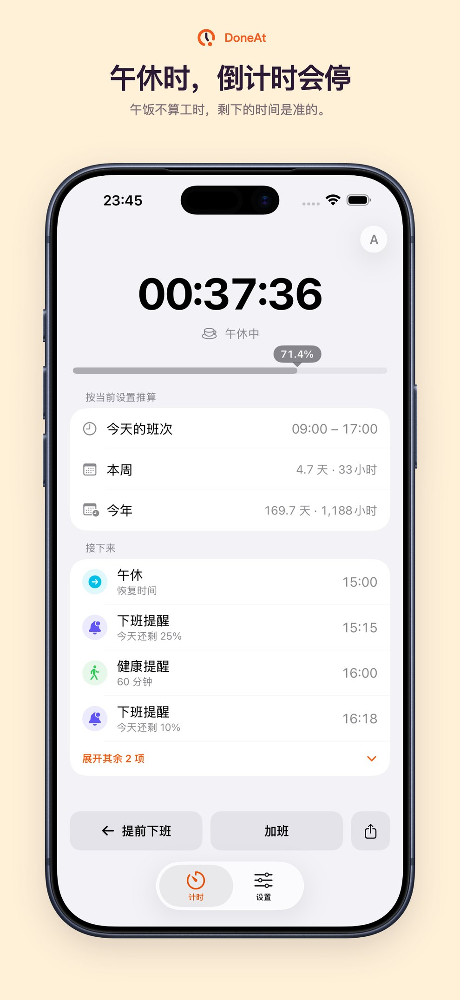

## 项目地址

App Store：[DoneAt - 下班倒计时](https://apps.apple.com/cn/app/id6802803318)

官网：[https://doneat.app/zh-CN](https://doneat.app/zh-CN)

网页版：[https://off.rainif.com/zh-CN](https://off.rainif.com/zh-CN)

源码：[https://github.com/ififi2017/Off-Work-Countdown](https://github.com/ififi2017/Off-Work-Countdown)

## 从网页走到现在

五月写过一篇[下班倒计时](/posts/off-work-countdown/)。当时它只是一个 Next.js 网页：设好上下班时间，看进度条把今天剩下的工时一点点磨完。没有账号，没有后端，计算全在浏览器里。

用了一阵之后，短板很清楚。标签页一关，提醒就没了。手机上它也只是个能「添加到主屏幕」的 PWA，主屏幕、锁屏、灵动岛上都插不进去。

所以后面做了两件事：桌面客户端，以及真正的 iOS / macOS App。商店里的名字改成了 **DoneAt**。功能行还是「下班倒计时」。

## 网页做不到的两件事

桌面端先做。当时评估过 Web Push，否掉了：要把每个人的下班时刻传到服务器，才能在关页之后还响；还得为分钟级调度付一笔持续的账单。这和「数据不出这台设备」对着干。

换成桌面端之后，Rust 侧只拿一个绝对时间戳做本地定时器。关窗口、提醒照发，菜单栏继续走字。不上传任何东西，也没有那笔服务端成本。

手机是另一条路。PWA 能用，但小组件、锁屏实时活动、灵动岛，网页做不出来。中间试过把现有界面塞进 Capacitor，真机上看就是一个套了壳的网站：留白、卡片层级、导航都不像给手指用的。那次尝试已经归档，正式包是 SwiftUI 原生，不嵌 WebView。

业务规则没有重写一份。排班、午休、加班、提醒的唯一实现仍是 TypeScript 里的那套函数；构建时打成规则包，iOS 用 JavaScriptCore 消费结果。Swift 只负责本地状态、系统 UI 和生命周期。跨夜班、大小周、轮班轮休这些边界，桌面、网页和 iPhone 算出来是同一个答案。

## 计时页只做钟

iOS 上第一眼看到的不再是一张配置表。欢迎页走一次：班次、午休、提醒、隐私，配齐就进计时。以后改时刻去设置。老用户打开直接进当前状态，不会被欢迎页拦一次。

有排班时，计时页按今天走到哪一截来显示：

- 上班前，倒数到开工
- 工作中，倒数到下班，进度按有效工时走
- 午休穿插在下班倒计时里，不另开一页
- 到点结算；还可以登记加班，「其实还没走」
- 休息日是一段弱倒数，数到下一班

今天临时有变化，不用重做排班：提前上班、提前下班、加班，或者没排班的一天按「手动计时」开始。分享出去的是一张图，或一条打开即是同一班次时刻的链接；链接里不带薪资。

*商店介绍图。剩余时间、今日进度，以及接下来要发生的事，都在这一屏。*

## 不用打开也能看见

装到 iPhone 上，真正多出来的不是再做一个倒计时页面，而是系统表面。

主屏幕和锁屏可以放小组件。锁着屏幕时，实时活动继续走。带灵动岛的机型，倒计时可以缩在岛上。计时页本身用了 iOS 的玻璃质感，放在这些表面旁边时，看起来像系统的一部分，而不是贴了一张卡片。

有一项刻意的限制：小组件、通知和实时活动里**不会出现薪资金额**。今日已赚只在 App 里。投影到系统表面的是时间、进度和下一件要发生的事。

Mac 走同一条 App Store 记录。装一次，iPhone、iPad 和 Mac 都能用。macOS 13 以上可以装，商店版带倒计时小组件。GitHub 上的桌面客户端仍然免费，菜单栏会一直走着剩余时间。

*中号、大号小组件和灵动岛，倒计时一直在走。*

## 午休要停

更早的版本里，倒计时本质是一对时间戳。一对数字撑不住午休、加班和「下一班几点来」。

现在一个班次是分段的。开了午休，中间挖掉一段：剩余时间在午饭时不往下走，进度也不涨。午饭不算工时，剩下的数字才是准的。

固定工作日、大小周、上几休几、跨午夜的夜班，都建立在这套分段上。默认班次仍是 09:00–17:00、周一到周五；图标指针指着五点，不是装饰，是产品默认的下班时刻。

*午休时倒计时会停。午饭不算工时。*

## 现在能做什么

- **设一次排班**：固定工作日、大小周、轮班轮休，或先不排班、当天手动开始
- **实时倒数**：上班前数到开工，工作中数到下班，精确到秒
- **午休从工时里扣除**：进度和剩余时间都会停
- **今天临时改**：提前上班、提前下班、加班、手动计时
- **可选的今日已赚**：以及按当前设置推算的本周、今年汇总
- **班次、午休和起身提醒**：关了页面之后，装在设备上的客户端仍可以响
- **主屏幕 / 锁屏小组件、实时活动、灵动岛**
- **iPhone 横屏和 iPad 大屏布局**
- **分享**：一张图，或一条打开即是同一班次的链接
- **19 种语言**，跟随系统语言
- **本地优先**：不用注册，排班和薪资只留在这台设备上，断网也能用

薪资与时间汇总只供自己心里有数，不是工资条。具体金额不会出现在小组件、通知或实时活动里。

## 为什么叫 DoneAt

「下班倒计时」当功能名没问题，当主屏幕名字太长。英文 Off Work Countdown 更长。商店主名、启动页、小组件画廊、灵动岛标题，需要一个短的、不随语言翻译的词。

DoneAt 的读法是 DoneAt: Work Shift Countdown。英文品牌句是 Know when your time is yours；中文是「几点下班，心里有数」，不是英文字面直译。

图标从通用橙环时钟换成现在这枚断口钟：橙环在五点断开，指针指 12 和 5，缺口里有一颗脱落的橙点。老图标的橙环和米色指针刻意留着，让用过网页版的人还能认出来。

GitHub 仓库还叫 `Off-Work-Countdown`，bundle id 也还是 `com.rainif.offworkcountdown.macappstore`。改的是人看得见的名字，不是升级链和本地数据。已经装过的人不用卸了重装。

官网和网页也拆开了。`doneat.app` 是品牌门厅和商店入口；能直接倒计时的 Web App 仍在 `off.rainif.com`。网页的排班和薪资存在那个域名的 localStorage 里，搬家会把老用户的设置弄丢，所以没搬。

## 上架这一路

Mac 商店版原先是单独的付费应用。Apple 的通用购买要求 iPhone 和 Mac 用同一条 App Store Connect 记录、同一个 bundle id。分开的记录合并不了，所以 iOS 没有另开一条，而是并进现有记录，整条改成免费下载。

最低系统是 iOS 26 / iPadOS 26，Mac 是 macOS 13。体积大约 5.3 MB。App Store 的「App 隐私」一栏写的是「未收集数据」：没有账号，没有行为分析，排班和薪资只留在这台设备上。

商店图没有靠每次手工截。仓库里有一套脚本：模拟器布景、套框、合成、校验尺寸和透明通道。文案改了可以只重排，不必重截。App Store Connect 不收带透明通道的 PNG，所以合成那一步必须保证背景完全不透明。

启动页踩过一个坑。试过 19 份 `LaunchScreen.strings`，也试过每个语言一份 storyboard，日文模拟器上仍显示英文。启动页在 App 建立起本地化上下文之前就加载，只认 Base。所以启动页现在就是 mark 加 DoneAt，不写副标题；要说用户语言的句子，放进第一帧 SwiftUI。

3.1.8 已经在商店里。更新说明的第一句是：「下班倒计时」现已更名为 DoneAt。

## 后话

它还是那个可以一直开着的小工具。设一次班次，看还剩多久。只是现在可以放进主屏幕、锁屏和灵动岛，关了页面也还在走。

网页版继续留着，打开就能用。想要系统提醒和小组件，去 App Store 装 DoneAt。Windows 在 [Microsoft Store](https://apps.microsoft.com/detail/9PM0HJ2PP2LJ)。源码以 MPL-2.0 开源。

五月那篇的最后一句是：如果你也有「想要一个简单到不能再简单」的小工具念头，建议直接动手写。三个月后回头看，这句话仍然成立——只是「简单」并不等于「只做一个网页」。

## 相关链接

- [App Store：DoneAt - 下班倒计时](https://apps.apple.com/cn/app/id6802803318)
- [官网 doneat.app](https://doneat.app/zh-CN)
- [网页倒计时](https://off.rainif.com/zh-CN)
- [源码 Off-Work-Countdown](https://github.com/ififi2017/Off-Work-Countdown)
- [五月那篇：下班倒计时](/posts/off-work-countdown/)
