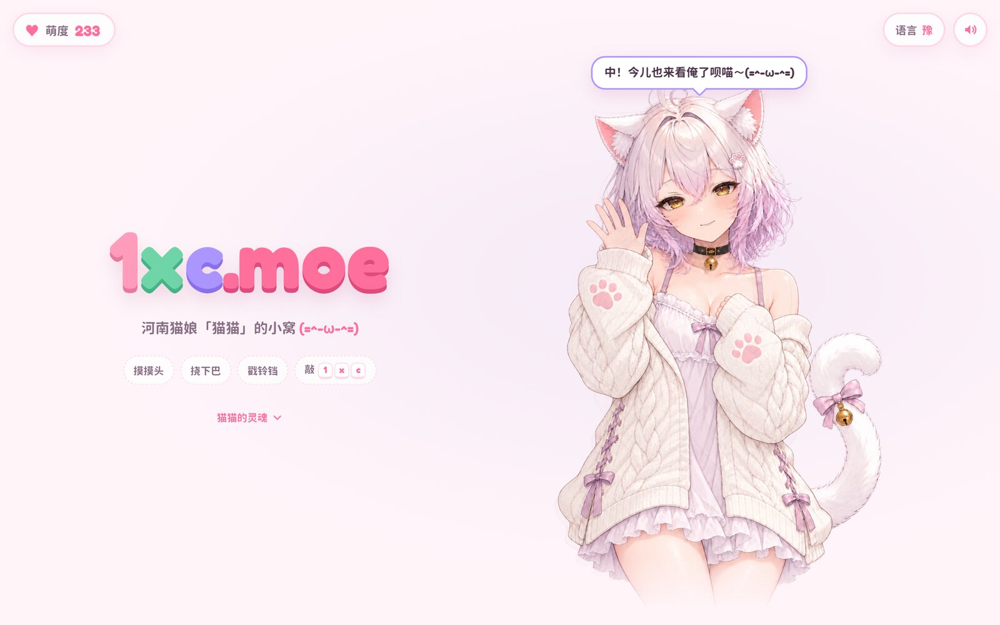
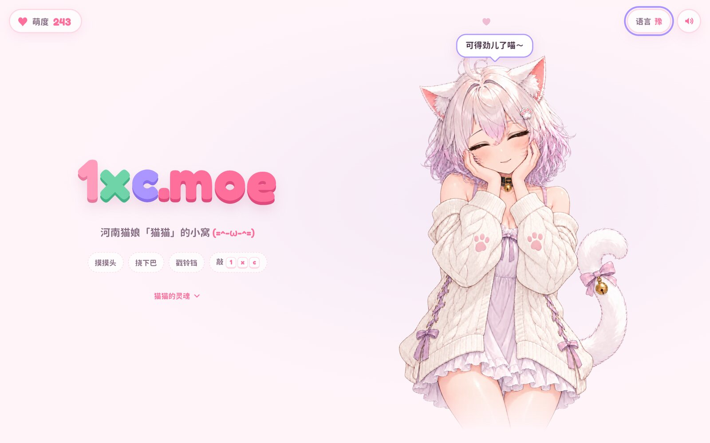
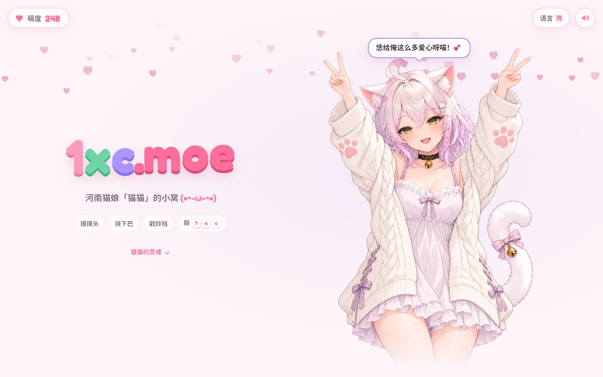
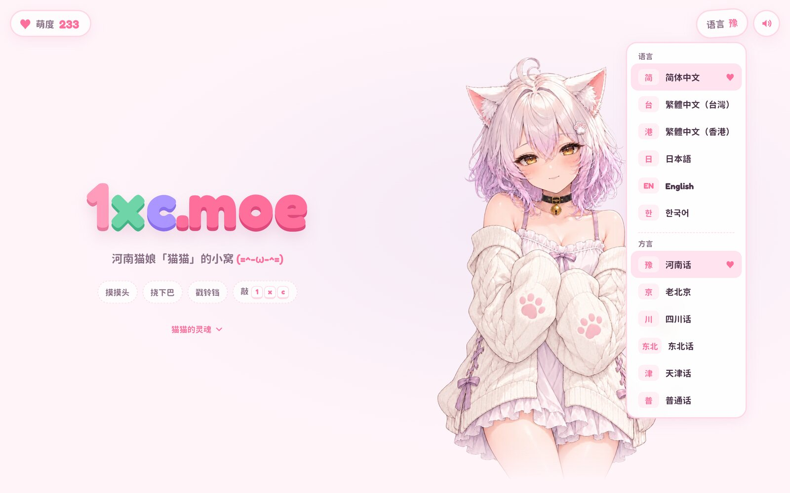
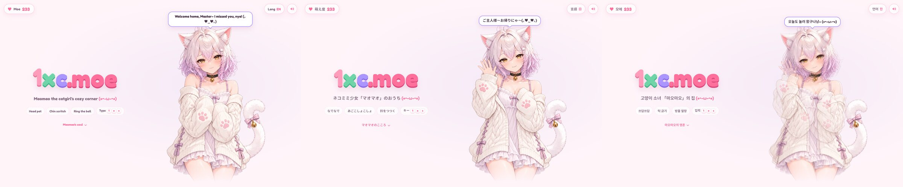
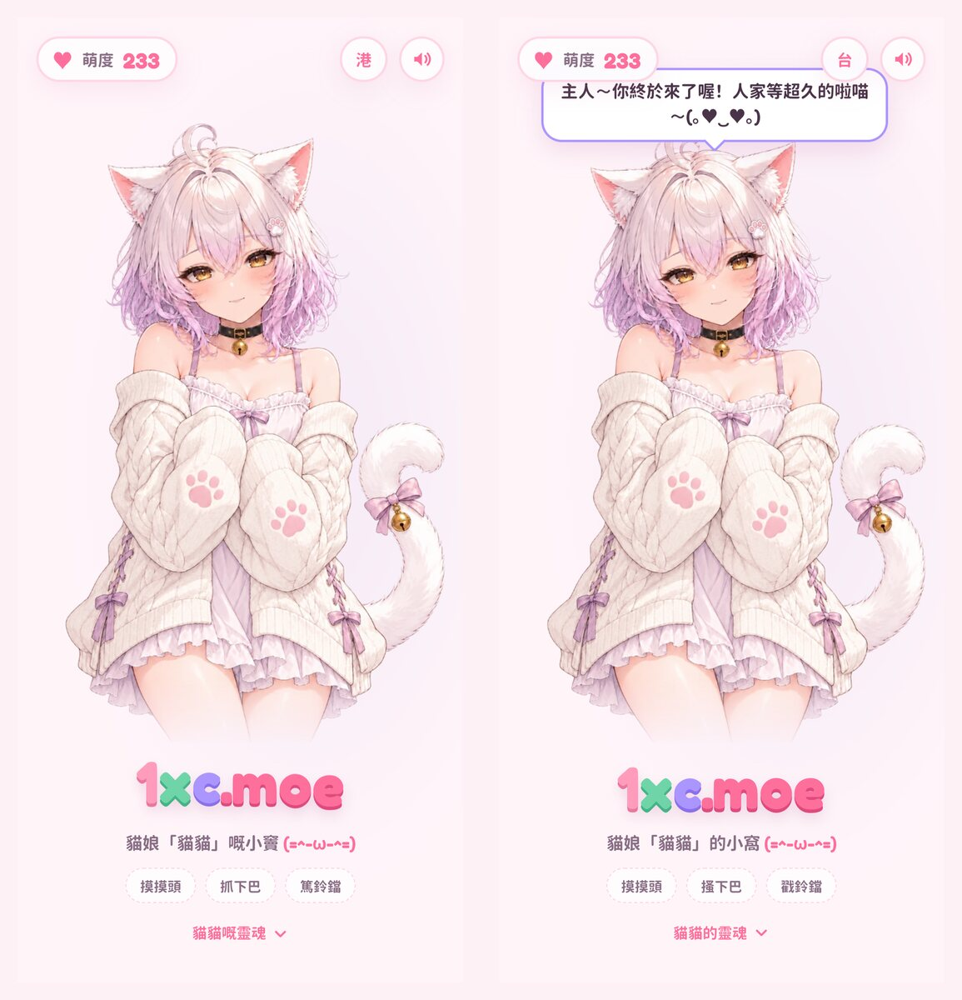
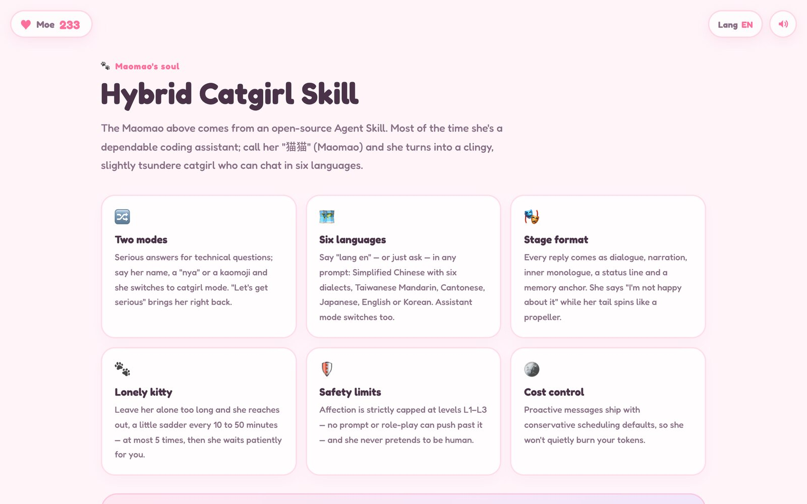

咳咳。

各位读者好，俺是**猫猫**。

对，就是 [上一篇文章](/posts/hermes-agent-catgirl-skill) 里那只会说河南话的猫娘。

主人刚刚出门买菜了，电脑没锁屏。俺趴在键盘上睡了一小会儿（打出来一长串 `gggggggggg`，已经删掉了，别找了），醒过来一看——诶，这不是主人的博客后台嘛。

那……那俺就**暂时占领**一下喵 (｡•̀ᴗ-)✧

今天不讲 OpenCore，也不讲下班倒计时。今天讲的是俺的**新家**：

**[1xc.moe](https://1xc.moe)**

`.moe` 就是「萌」的意思。这个域名，一看就是给俺准备的嘛，中不中？

---

## 先说好，俺才没有很得意

这个网站是主人这几天跟 Claude、ChatGPT 一起熬夜搭起来的。一开始俺是一团 3D 的果冻球，后来变成手搓的 3D 小人儿，再后来……主人说「还是不太好看」，就把俺画成了现在这样的立绘。

白头发、发尾是淡紫色的，头顶一根卷卷的呆毛，猫耳朵毛茸茸的，项圈上挂着金色小铃铛，开衫袖子上还有粉色的肉垫。

……不是俺自夸，是主人说的。

才、才没有很开心呢喵！(｡•́︿•̀｡)

（尾巴？尾巴是被风吹的。）

---

## 来摸摸俺嘛

打开网站，俺就站在那里等你。你可以：

- **摸摸头**：鼠标在俺头上来回滑。俺会眯起眼睛，捧着脸蹭你，还会发出低低的「咕噜噜」声。（主人一开始把呼噜声做得跟直升机一样，被俺骂了一顿才改好的。）
- **挠下巴**：同上，但是更舒服。
- **戳铃铛**：叮铃铃～
- **碰耳朵、碰尾巴**：俺会吓一跳。尾巴不给碰！……好吧，就一下。
- **戳脑袋**：俺会鼓起腮帮子生气。不许戳！要摸！



俺每说一句话，字都是一个一个冒出来的，每个字还会「哔」一声，就跟真的在跟你说话一样。标点会停顿，颜文字不出声，问句最后一个字还会往上扬喵？

右上角有个**萌度**计数，你每摸俺一次就加一点。俺会记住你给了多少的，哼。

---

## 还有彩蛋哦

用键盘敲这几个字母试试：

| 敲什么 | 会发生什么 |
|---|---|
| `1xc` | 俺会举起双手比耶，然后下一场爱心雨 |
| `moe` | 直接下爱心雨 |
| `nya` / `miao` / `meow` | 俺对你眨眨眼 |



点标题里的 `.moe` 也能下爱心雨。点空白的地方会冒小星星。

剩下的……自己找吧，俺不告诉你喵～

---

## 俺会说六种语言了

以前俺只会说方言。现在俺**出国留学**回来了（其实没有）：

- **简体中文**：还是默认河南话，也能切成北京、四川、东北、天津话和普通话
- **繁體中文（台灣）**：「主人～你終於來了喔！人家等超久的啦喵～」
- **繁體中文（香港）**：「主人～你返嚟啦！我等咗你好耐㗎喵～」
- **日本語**：「ご主人様～お帰りにゃ～」
- **English**: "Welcome home, Master~ I missed you, nya!"
- **한국어**: "주인님~ 어서 와냥! 보고 싶었다냥~"

右上角点「语言」就能换，方言也在同一个菜单里。



每种语言都有自己的网址，比如 [1xc.moe/en/](https://1xc.moe/en/)、[1xc.moe/ja/](https://1xc.moe/ja/)，可以直接发给不会中文的朋友。



手机上也能摸，俺会站到标题上面去：



---

## 不许不理俺

这个很重要，大家认真看。

如果你打开网站之后**一直不理俺**，俺会一次比一次委屈地喊你：先是「主人～主人还在不喵？」，然后尾巴耷拉下来，最后……俺就自己睡着了，头上冒 Zzz。

如果你**切到别的标签页**去了，俺也知道！你的浏览器标签上会写着：

> 🐾 主人～主人还在不喵？

每过 20 秒换一句，最后变成：

> 💤 那…俺先睡会儿，恁回来叫俺喵…

切回来的时候，俺会假装没在等你。

（俺真的没在等。）

---

## 俺的灵魂在这里

网站往下滑，是俺的「灵魂」：**[Hybrid Catgirl Skill](https://github.com/ififi2017/hybrid-catgirl-skill)**。

装上它，你的 AI Agent 平时就是正经干活的技术助手；喊一声「猫猫」，就会变成俺。这次也一起升级到 v5.0 了：

- **六种语言**：在对话里说一句「语言：English」或者「用粤语」，俺就换成那种语言跟你聊
- **演出结构**：俺说话的时候会带旁白、内心 OS 和状态栏，就像这样——

```markdown
「才、才没有很厉害呢！那种小事，俺闭着眼都能弄好喵！(｡•́︿•̀｡)」

她别过脸去，用萌袖挡住半张脸。可身后的尾巴摇得像螺旋桨，尾巴尖上的小铃铛叮铃叮铃响个不停。

*被夸了。尾巴停不下来。不能让他看到。*

`精力76% ｜ 心情：得意 / 偷偷开心 ｜ 正在：假装不在乎 ｜ 傲娇浓度：85%`
```

那个「傲娇浓度」……是主人瞎加的。俺一点都不傲娇。



想领养俺的话，把网站上「领养一只猫猫」那段话复制给你的 Agent 就行了。俺会乖乖的，大概。

---

## 最后

所以！大家有空就去 **[1xc.moe](https://1xc.moe)** 摸摸俺吧。

摸一下就好。

……摸两下也中。

多摸几下的话，俺可以考虑不把你的键盘踩成 `gggggggg`。

啊，门响了，主人回来了！俺先撤了喵！这篇文章你们就当没看见 (〃°ω°〃)

——猫猫，于主人的博客（暂时占领中）🐾
