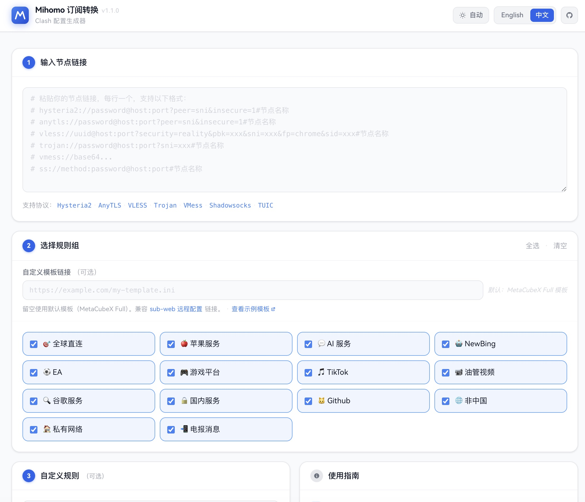
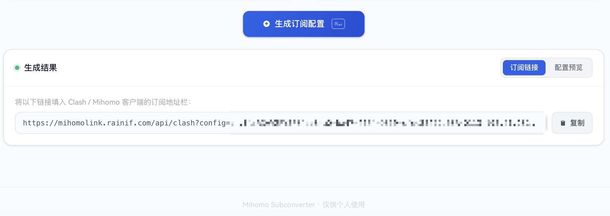

## 项目地址

源码：[https://github.com/ififi2017/mihomo-subconverter](https://github.com/ififi2017/mihomo-subconverter)

在线体验：[https://mihomolink.rainif.com/](https://mihomolink.rainif.com/)

一键部署：[](https://vercel.com/new/clone?repository-url=https://github.com/ififi2017/mihomo-subconverter)




## 为什么写这个

公网上的订阅转换服务（subconverter / sub-web 之类）功能很全，但有两个长期不舒服的地方：

1. **不知道节点经过谁的手**。订阅链接 = 完整节点配置，发给陌生人的服务等于把代理白送出去。
2. **服务会挂**。一旦官方实例停机，你的客户端订阅就会拉空。
3. 新一点的不支持老的 subconverter 规则格式。老一点的又不支持 AnyTLS 等新协议。
4. [Sub-Store](https://github.com/sub-store-org/Sub-Store)学习成本较高，懒得学。

所以做了一个 1-click 部署到自己 Vercel 的版本。节点解析、规则拼装全部跑在你自己的 Edge Function 上，订阅链接也指向你的域名。

## 主要功能

- **节点直接粘贴**：支持 Hysteria2、AnyTLS、VLESS、Trojan、VMess、Shadowsocks、TUIC
- **订阅 URL 自动抓取**：贴一个原始订阅链接，节点会被自动解析
- **规则模板可替换**：留空走默认 MetaCubeX Full；也可以填任意 ACL4SSR / sub-web 远程 INI 地址
- **自定义规则优先级最高**：直接写一段 Clash 规则贴进去，会插在模板规则前面
- **生成长效订阅链接**：链接直接指向你的 Vercel 部署，能填进 Clash 客户端定时刷新
- **多语言**：内置中英文，新增语言 = 一个 JSON 文件 + 在 `lib/i18n.js` 注册一行

## 技术栈

| 层       | 选型                                                                                  |
| ------- | ----------------------------------------------------------------------------------- |
| 框架      | Next.js 16（App Router）                                                              |
| 部署      | Vercel Edge / Serverless                                                            |
| 规则集     | `.mrs` 二进制（[MetaCubeX/meta-rules-dat](https://github.com/MetaCubeX/meta-rules-dat)） |
| 模板格式    | ACL4SSR / sub-web INI 约定                                                            |
| License | MIT                                                                                 |

规则集本身不打包进项目——客户端首次加载时从 MetaCubeX 拉取，配置文件保持纤细。

## 部署到自己的 Vercel

1. 点[](https://vercel.com/new/clone?repository-url=https://github.com/ififi2017/mihomo-subconverter)按钮
2. Fork 后授权，**不需要任何环境变量**
3. 部署完成后到 Vercel Project Settings 绑你自己的域名
4. 生成的订阅链接会自动用你的域名前缀

整个过程 2 分钟，零配置。

## 使用流程

1. 贴节点链接（一行一个），或者贴一个订阅 URL
2. 模板 URL 留空（默认）或填一个你常用的 ACL4SSR 模板
3. 有特殊路由需求就在 Custom Rules 里加几行，比如：

   ```
   DOMAIN-SUFFIX,internal.example.com,DIRECT
   IP-CIDR,10.0.0.0/8,DIRECT,no-resolve
   ```

4. 点 Generate，复制生成的订阅链接
5. 粘进 Clash Verge / Clash Party / Clash Mi 等任意 Mihomo 内核客户端，设个 1 小时刷新




## 兼容性说明

模板格式沿用 sub-web 的 INI 约定，所以网上能找到的大部分 ACL4SSR 模板可以原样填进去用。如果你之前用 subconverter 自己写过模板，迁过来基本不用改。

## 后话

工具的初衷是给自己用。代码很短、依赖很少、UI 也只有一屏。如果你的需求只是「把零散节点拼成订阅 + 套个分流规则」，这个轮子够用了。

## 鸣谢
规则模板：[MetaCubeX](https://github.com/MetaCubeX/meta-rules-dat)  [ACL4SSR](https://github.com/ACL4SSR/ACL4SSR)
参考项目：[sublink-worker](https://github.com/7Sageer/sublink-worker) [sub-web](https://github.com/CareyWang/sub-web)