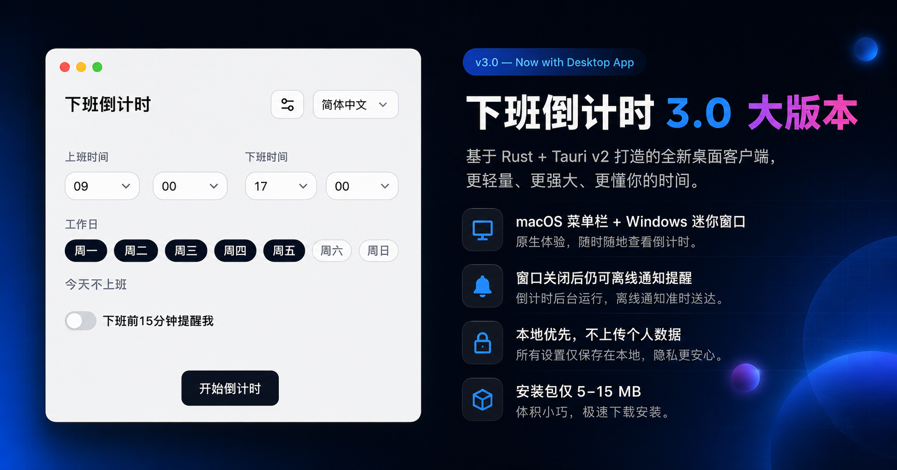

## 一个做了两年的事

2024 年秋天，[Off Work Countdown](https://off.rainif.com) 上线了第一个版本。

它的想法很简单：打开网页，设好上下班时间，就能看到今天还剩多少班要上。没有注册、没有广告，所有数据都存在本地浏览器里。

两年过去了，它从一行倒计时，慢慢长成了一个有 19 种语言、支持 PWA 离线、带预设班次分享的小工具。GitHub 上有了 8 个 Star，每天有人在用。

但真正让它成为一个「产品」的，是今天这个版本。

## v3.0：一次定位升级

3.0 不是堆功能。

它是一个从「能用的工具」到「能被发现、被记住、被分享、还能常驻桌面的产品」的跨越。三个数字可以说明这次升级的目标：

- **能被搜到**：以前搜索引擎爬到的是一页空白。现在 19 个语言版本都有真实内容、结构化数据和完整的 sitemap。
- **能被记住**：新增了智能提醒、周期汇总和周次选择。
- **能被分享**：预设班次页面（996、朝九晚五、朝九晚六、夜班）加上可分享的状态 URL，你发一个链接给同事，对方打开就能直接用。

但最值得一提的，是 3.0 的桌面端。

## 桌面客户端：轻到极致

桌面端不是一个「顺便做了」的功能。它是整个 3.0 计划里最重要的一块，也是花时间最多的。

但你猜它的安装包有多大？

**macOS 版不到 10 MB，Windows 版不到 15 MB。**

要知道，如果用 Electron 做同样的事，起步就是 150 MB。而这套工具体积小的原因，在于它的底层用的是 **Rust + Tauri v2**。

Tauri v2 用的是操作系统的原生 WebView 来渲染界面，而不是像 Electron 那样捆绑一整个 Chromium。这意味着：

- **安装包小**：5–15 MB，下载用不了几秒
- **内存占用低**：常驻 60–100 MB，而不是 200–300 MB
- **启动快**：点击即开

对于一个要开一整天的常驻工具来说，「不占地方」本身就是最重要的功能。

## 两个平台，两种原生形态

桌面客户端同时支持 **macOS（Apple Silicon + Intel）** 和 **Windows（x64 + ARM64）**。虽然底层代码是同一套，但两个平台的交互方式完全不同：

**macOS 上**，它藏在菜单栏里。你设好班次后可以关掉窗口，剩余时间会直接显示在屏幕右上角的菜单栏上。点击图标弹出一个原生面板，失焦自动隐藏——和 Mac 上那些系统工具的使用习惯完全一致。

**Windows 上**，它是一个可置顶的迷你窗。默认停在屏幕右下角、任务栏上方，不会占用任务栏空间。窗口上有一个小图钉按钮，你可以决定是否让它始终保持在最前面。

两种形态解决的问题是一样的：**不用每次都打开浏览器去看还有多久下班。** 它就在那里，瞟一眼就知道。

## 关窗也不会错过提醒

这是桌面端最实的价值，也是 Web 端做不到的事。

在浏览器里，如果你关掉了标签页，提醒就没了。网页推送可以解决这个问题，但那意味着要把每个人的下班时间上传到服务器——推翻「数据不出本地」的承诺。

桌面端没有这个矛盾。Rust 后台有一个真实的本地定时器，窗口关闭后它照样运行。到点了，系统会直接发出原生通知。**不需要服务端、不需要上传任何东西、不产生持续成本。**

## 本地优先，而不是本地妥协

隐私在这里不是一个口号，而是架构选择。

桌面客户端没有任何使用分析，不会把你的班次、薪资或任何用户标识发送到服务器。设置存在本地的 Tauri Store 里，所有倒计时和收入估算都在本地计算。它只有在做下面几件事时才会联网：

- 检查更新
- 打开外部链接
- 分享到社交平台

仅此而已。

## 开箱即用的功能清单

如果你下载桌面端，你会得到：

- **托盘倒计时**：macOS 菜单栏实时显示剩余时间
- **原生提醒**：窗口关闭也不丢失
- **紧凑迷你窗**：Windows 上的常驻小部件，可拖动、可置顶
- **开机自启**：登录后自动运行
- **全局快捷键**：一键唤出主窗口
- **自动更新**：新版本发布后，应用内直接升级
- **多主题**：深色模式、赛博朋克主题、日落主题

以及网页版已有的全部功能：

- 自定义上下班时间与工作日
- 薪资估算（支持月薪、年薪、时薪）
- 4 种预设班次一键切换
- 可分享的状态链接
- 周期汇总（日、周、月）
- 19 种界面语言
- PWA 离线支持

## 免费、开源、MIT 协议

整个项目在 [GitHub 上开源](https://github.com/ififi2017/Off-Work-Countdown)，采用 MIT 协议。你可以查看全部代码、报告问题、提出建议，或者 fork 一份自己修改。

桌面端同样开源。Rust 侧的代码在 `src-tauri/` 目录下，逻辑清晰，大约 250 行——因为核心的倒计时算法仍然复用前端已有的 69 行纯函数，不做重复实现。

## 如何获取

桌面客户端可以从以下渠道下载：

- **[项目官网下载页](https://off.rainif.com/zh-CN/download)**：自动识别你的操作系统，推荐对应版本
- **[GitHub Releases](https://github.com/ififi2017/Off-Work-Countdown/releases)**：查看所有发布的版本和更新日志

当前支持：

| 平台 | 架构 | 安装包格式 |
|------|------|-----------|
| macOS | Apple Silicon (M 系列) | .dmg |
| macOS | Intel | .dmg |
| Windows | x64 | NSIS 安装包 + MSI |
| Windows | ARM64 | NSIS 安装包 + MSI |

无需注册，下载即用。

---

**下班倒计时** — 一个面向 Web、macOS 和 Windows 的免费、开源、本地优先的工作日计时工具。

**从今天开始，你的倒数计时器可以常驻桌面了。**