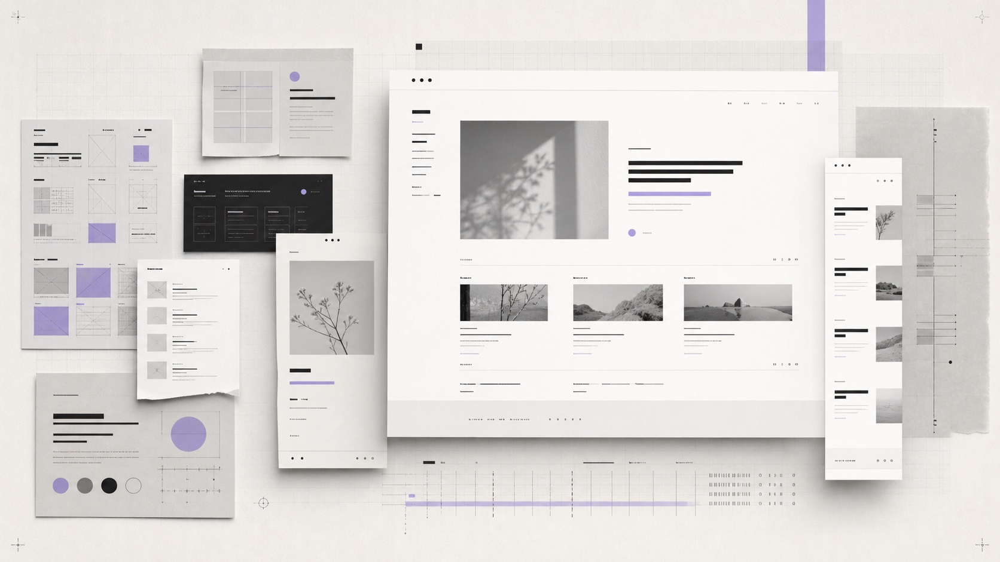

## 起因

这个 Blog 的内容系统其实已经够用了：Next.js App Router、Markdown 文章、静态导出、Pagefind 搜索、RSS，该有的都有。

问题在于，它只是「能用」。

页面没有明显错误，但首页、归档、标签、Bio 和文章页各自说着不同的视觉语言。很多地方像是把常见博客组件依次放进页面：一块 Hero、几张卡片、一个标签云。信息都在，却没有形成属于这个站点的节奏。

此前 Claude Code 已经重构过整个 Blog 的基础结构。这一次我没有再推倒重写，而是让 Codex 在现有项目上使用 [taste-skill](https://www.tasteskill.dev/) 做一次完整的 UI 重建。



*题图由 OpenAI 图像模型生成。*

## taste-skill 实际做了什么

taste-skill 不是一套现成组件，也不是「输入一句话，自动生成高级页面」的主题模板。

这次对我最有用的，是它先要求 Agent **阅读项目和设计语境，再决定应该怎么改**。对于这个博客，最终的判断是：

- 页面类型是个人博客，而不是产品 Landing Page
- 阅读体验比炫技更重要
- 保留现有纸白、墨黑和淡紫色强调
- 使用编辑式排版、非对称留白和明确的信息层级
- 动效保持克制，不用大面积渐变、玻璃效果和悬浮卡片
- 卡片只在确实需要表达层级时出现

这些约束看起来没有直接产出代码，却能阻止最常见的问题：Agent 一上来就套用自己熟悉的「AI 网站风格」。

简单说，taste-skill 负责让设计判断先发生，Codex 再负责把判断变成真实的 React、CSS 和响应式规则。

## 先重做首页的阅读顺序

旧首页最大的问题不是不好看，而是所有内容的权重太接近。

重构后，首页被拆成三个清晰层级：

1. 中文主标题负责表达这个博客在做什么
2. `Write it down, if it rains.` 作为独立签名存在，不再和中文说明挤在同一行
3. 最新文章成为真正的 Featured 内容，其余文章进入更安静的列表

英文签名被单独拿出来以后，反而比放在大标题里更有辨识度。它不需要抢主标题的位置，而是像署名一样留在页面里。

首页文章卡片也不再平均用力。第一篇文章使用大图与摘要，后面的文章只保留日期、分类、阅读时间和标题。这样读者进入首页后，不需要先理解页面结构，就能直接找到阅读入口。

## 文章页：先解决手机上最明显的问题

文章页原本的元信息是一长排：

`2026 · 05 · 27 / UPDATED 2026 · 05 · 27 / 项目 / 5 MIN`

桌面端尚可，到了手机上，日期间隔、更新时间、分类和阅读时间互相争抢空间，换行也没有规律。

这次把它重新分成两组：

- 发布时间与更新时间
- 分类与阅读时间

日期格式改成更紧凑的 `2026.05.27`，`UPDATED` 也换成中文的「更新于」。不是为了把所有东西压得更小，而是让同一类信息待在一起，移动端自然就能形成两行稳定布局。

## 归档和标签不应该只是数据堆叠

归档页很容易做成一张年份表，标签页也很容易退化成大小不一的词云。两者都能工作，但都缺少可扫描性。

新的归档页把年份当作章节编号，文章行统一展示日期、分类、阅读时间和标题。悬停时只有轻微位移和箭头反馈，重点仍然是快速浏览。

标签页则改成主题索引：

- 标签数量同时通过字号和数字表达
- 每个标签拥有完整的点击区域
- 手机端直接收成单列，不保留拥挤的词云
- 分类作为独立 Collection 放在标签索引之后

标签详情页和分类详情页继续复用归档页的文章行，让站内同一种内容保持同一种阅读方式。

## Bio 页：从资料列表变成个人页面

Bio 页是这次变化最大的一页。

头像、名字和自我介绍被组成一个非对称的开场区域；「现在」和「找到我」在桌面端并列；「关于本站」独占下一整行。移动端则按内容顺序自然收成单列。

这里也经历了一次很具体的来回调整。

最初「关于本站」位于右栏，看起来像附属信息。把它横跨两栏以后，授权说明和站点信息终于有了完整的一行。但我又给正文加了 `max-width: 78ch`，导致一句明明有空间的 License 说明提前换行。

最后的修正反而很简单：

```css
.rk-bio-site {
  grid-column: 1 / -1;
}
```

取消多余的行宽限制，让内容真正使用已经争取到的空间。这个小问题也提醒我：排版规则不是越多越好，限制必须能解释自己为什么存在。

## UI 重构也会暴露工程问题

视觉改造过程中还遇到了一个和设计无关、但必须解决的问题。

访问中文标签时，Next.js 在 `output: export` 配置下提示：

```text
Page "/tags/[name]/page" is missing param "/tags/[name]"
in "generateStaticParams()"
```

原因是开发环境访问编码后的中文路径时，静态参数与路由匹配没有保持一致。最终为开发模式补充了 URL 编码参数，同时让生产构建继续输出原始标签名。分类页也做了同样处理。

如果只盯着截图，这类问题很容易被忽略。但一个看起来更好的标签页，如果点进去直接 Runtime Error，就还不能算完成。

## 浏览器里的最后一公里

这次没有停在「代码已经改完」。

每一页都在本地服务器里实际打开，并分别检查桌面端和 `390px` 手机宽度：

- 标题有没有意外换行
- 页面是否产生横向滚动
- 标签和卡片的触控区域是否足够
- 中文标签、中文分类能否正常访问
- Bio 的两栏和整行布局是否符合预期
- 深色模式切换后，文字和边框是否仍然清晰

最后再运行 TypeScript 检查、`git diff --check` 和完整的生产静态构建。对静态博客来说，设计验证和构建验证缺一不可。

## 我对这次重构的感受

taste-skill 最有价值的地方，不是替我选了某个字号或圆角，而是持续追问：**这个决定是否符合当前页面，还是只是 Agent 最熟悉的默认答案？**

Codex 则把这套约束放进真实项目里执行：读已有代码、沿用数据结构、修改组件、启动服务器、看浏览器、根据反馈继续收紧细节。

最终结果并不是一套完全陌生的新主题。它仍然是原来的 Blog，只是首页更像入口，归档更像索引，标签更容易扫描，Bio 更像一个人的页面，文章也终于能在手机上安静地被阅读。

这大概就是我想要的重构：不是让网站看起来像别人的作品，而是让它更像自己。

## 相关链接

- [taste-skill](https://www.tasteskill.dev/)
- [Codex](https://openai.com/codex/)
- [本次 UI 重构 Commit](https://github.com/ififi2017/ififi2017.github.io/commit/1a1c842128577df34418543e4048886b12a58ea3)
